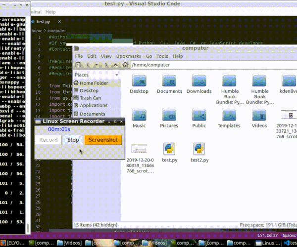

# Linux-Screen-Recorder
A simple Linux desktop recorder and screenshot program coded in Python.

Guide for Debian/Ubuntu-based distributions. If you're using a Arch-based distribution, replace apt-get with pacman.

Prequisites:
<ul style="list-style-type:square;">
  <li>sudo apt-get install ffmpeg</li>
  <li>sudo apt-get install python-tk</li>
  <li>sudo apt-get install python-pil</li>
  <li>sudo apt install python-pip</li>
  <li>pip install pyscreenshot</li>
  <li>pip install pyscreenshot</li>

